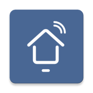

<p align="center">
  
</p>

# IFB Washer

Unofficial Home Assistant integration for Wi-Fi IFB washing machines connected to the My IFB app.

The integration signs in with your My IFB account, discovers your Wi-Fi washer, reads live status through MQTT, and exposes washer controls in Home Assistant.

## Features

- Config flow setup from the Home Assistant UI
- Phone or email OTP login
- Automatic washer discovery
- MQTT status updates with REST polling fallback
- Program selection
- Start, pause, cancel, power, and child-lock command buttons
- Program, phase, time remaining, progress, door, temperature, spin speed, child lock, and online/running status
- Diagnostic entities for decoded washer flags and alarm bytes

## Before You Install

You need:

- A Home Assistant instance where custom integrations are allowed.
- A My IFB account that already has the washer added in the official My IFB app.
- The washer should be a Wi-Fi model and should appear online in the My IFB app at least once.
- Your My IFB phone number or email address.
- The IFB app OAuth signing values required by the current login flow:
  - `oauth_consumer_key`
  - `oauth_consumer_secret`
  - `oauth_token`
  - `oauth_token_secret`

Do not use your Home Assistant long-lived token or your My IFB password in those OAuth fields. They are app signing values used only to sign the IFB OTP login requests.

## Installation

### HACS

1. Open HACS.
2. Add this repository as a custom repository:
   ```text
   https://github.com/khmkabeer/ha-ifb-washer
   ```
3. Choose category **Integration**.
4. Install **IFB Washer**.
5. Restart Home Assistant.

### Manual

Copy the integration folder into Home Assistant:

```text
custom_components/ifb_washer
```

The final Home Assistant path should be:

```text
/config/custom_components/ifb_washer
```

Restart Home Assistant.

## Setup

After Home Assistant restarts:

1. Go to **Settings > Devices & services**.
2. Select **Add integration**.
3. Search for **IFB Washer**.
4. Enter your My IFB phone number or email.
5. Select the login type, either phone or email.
6. Enter the calling code, for example `+91`.
7. Enter the four IFB app OAuth signing values.
8. Submit the form and wait for the OTP.
9. Enter the OTP sent by IFB.

The integration automatically discovers the first Wi-Fi washing machine on the account.

After setup completes, check the new IFB Washer device page for sensors, buttons, and the program selector. If the washer does not appear, confirm it is visible in the official My IFB app and try setup again.

The reusable login, token, discovery, and MQTT auth notes live in [docs/auth-flow.md](docs/auth-flow.md).

## Entities

### Sensors

- Program
- Phase
- Remaining time
- Program time
- Progress
- Door
- Temperature
- Spin speed

### Binary Sensors

- Online
- Running
- Child lock
- Unbalance

### Select

- Program select

### Buttons

- Start
- Pause
- Cancel
- Power
- Child lock on
- Child lock off

### Diagnostic Sensors

- Raw state
- Load
- Unbalance
- Water temperature
- Motor speed
- Alarm 1
- Alarm 2
- Alarm 3

## Notes

- Program names and status phases are decoded from observed My IFB app traffic and may vary by model.
- Command support depends on the washer being online and accepting commands at that moment.
- The power command is based on the washer command observed from the app. Some models may treat it as a toggle-style command.
- Multi-washer account selection is not yet exposed in the setup flow.

## Privacy

Access and refresh tokens are stored in the Home Assistant config entry, like other cloud integrations. Do not share Home Assistant diagnostics or logs if they include account or token data.

## Disclaimer

This project is unofficial and is not affiliated with, endorsed by, or supported by IFB.
